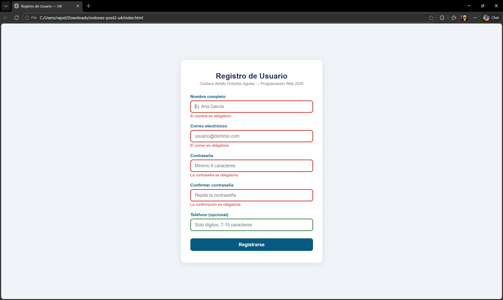
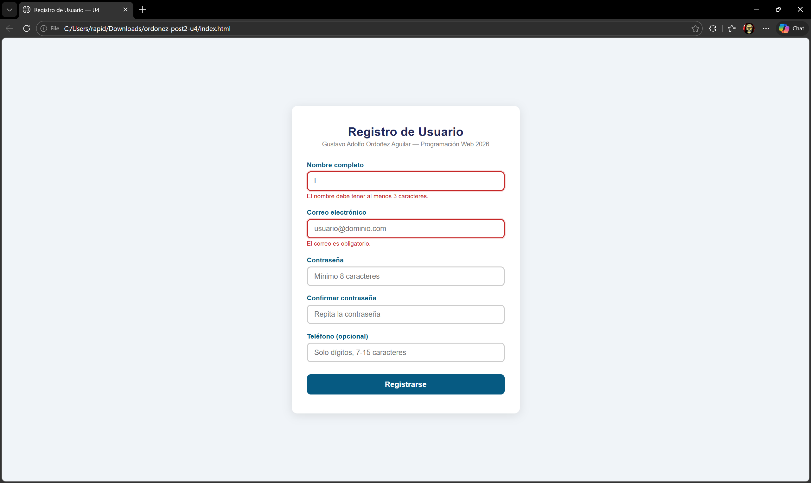
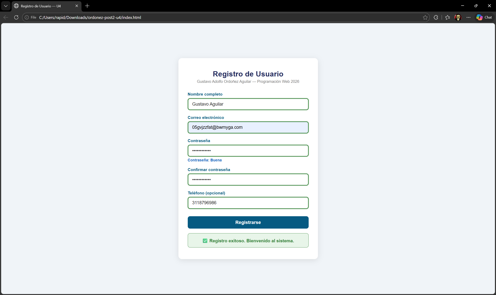
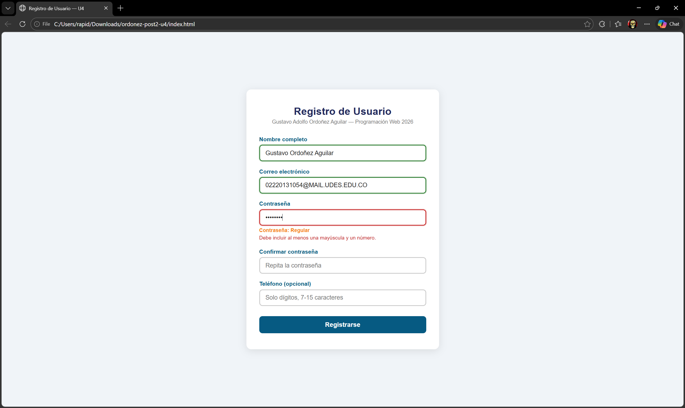

# ordonez-post2-u4 — Unidad 4: JavaScript Básico

## Nombre del Estudiante
**Gustavo Adolfo Ordoñez Aguilar**  
Ingeniería de Sistemas — Programación Web 2026

---

## Descripción del Proyecto

Formulario de registro de usuario con **validación completa del lado del cliente**, desarrollado como laboratorio de la **Unidad 4: JavaScript Básico — Post-Contenido 2** de la asignatura Programación Web (UDES).

### Funcionalidades implementadas
- ✅ Validación individual por campo con mensajes de error específicos
- ✅ Retroalimentación visual inmediata (bordes rojo/verde por campo)
- ✅ Validación en tiempo real con evento `blur`
- ✅ Control del evento `submit` con `e.preventDefault()`
- ✅ Expresión regular para contraseña (mayúscula + número)
- ✅ Verificación de coincidencia de contraseñas
- ✅ Teléfono opcional con validación de patrón
- ✅ Indicador de fortaleza de contraseña en tiempo real
- ✅ Mensaje de éxito y limpieza del formulario tras 2 segundos

### Conceptos de JavaScript aplicados
- Constraint Validation API: `validity.valueMissing`, `validity.tooShort`, `validity.typeMismatch`, `validity.patternMismatch`
- Manipulación del DOM: `classList`, `textContent`, `focus()`
- Eventos: `blur`, `input`, `submit`, `preventDefault()`
- ES6: `const`/`let`, arrow functions, template literals, desestructuración
- Expresiones regulares: `/^(?=.*[A-Z])(?=.*\d).+$/`

---

## Tecnologías Utilizadas

- HTML5 semántico con atributos de validación nativa (`required`, `minlength`, `pattern`, `type`)
- CSS3 (Flexbox, variables CSS, transiciones)
- JavaScript ES6+ Vanilla (sin frameworks externos)

---

## Estructura del Proyecto

```
ordonez-post2-u4/
├── index.html      # Formulario HTML5 con atributos de validación
├── styles.css      # Estilos CSS3 con estados válido/inválido
├── validacion.js   # Lógica de validación JavaScript completa
└── README.md       # Este archivo
```

---

## Cómo Ejecutar el Proyecto

### Opción 1 — Live Server (recomendado)
1. Abre la carpeta en **VS Code**
2. Clic derecho en `index.html` → **"Open with Live Server"**
3. Se abre en `http://127.0.0.1:5500`

### Opción 2 — Abrir directo
1. Doble clic en `index.html`

> Usar Google Chrome con DevTools (F12) para verificar los checkpoints.

---

## Capturas de Pantalla

### Checkpoint 1 — Errores al enviar sin llenar campos


### Checkpoint 2 — Validación en tiempo real


### Checkpoint 3 — Registro exitoso


### Checkpoint 4 — Indicador de fortaleza


---

## Historial de Commits

1. `feat: estructura HTML formulario registro con campos y spans de error`
2. `style: estilos CSS formulario estados valido invalido y mensaje exito`
3. `feat: funciones retroalimentacion validadores por campo Constraint API`
4. `feat: validacion blur tiempo real y control evento submit`
5. `feat: indicador fortaleza contrasena con expresion regular`

---

*Programación Web — Ingeniería de Sistemas — UDES 2026*
